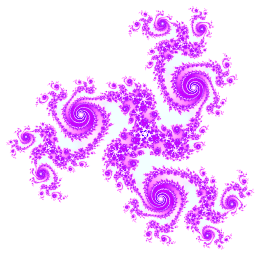
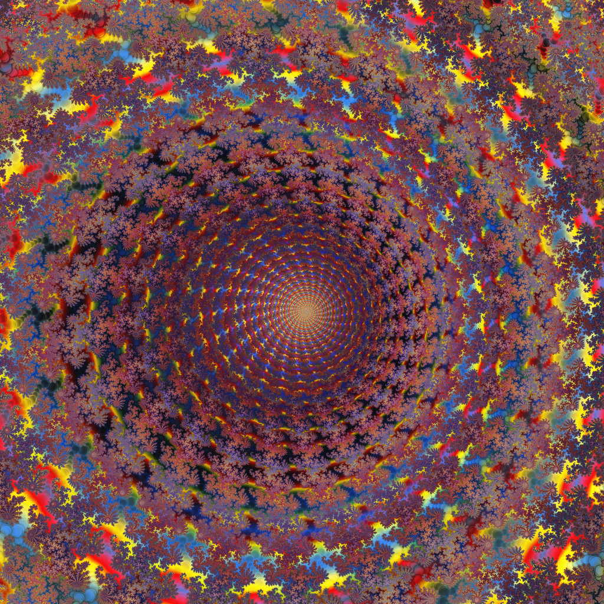
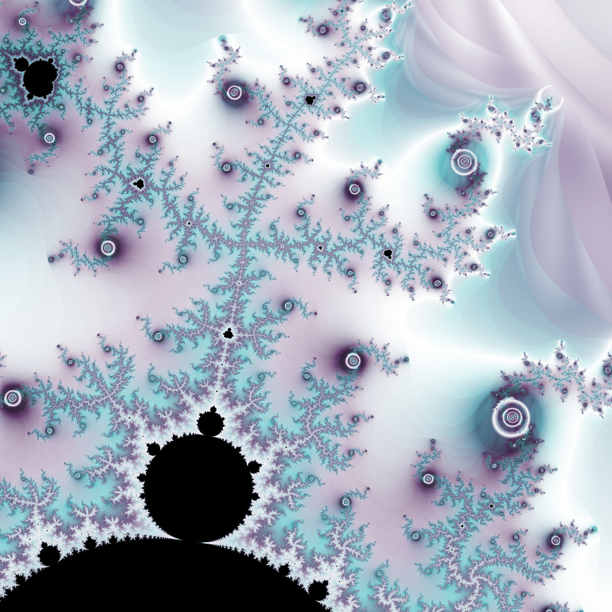
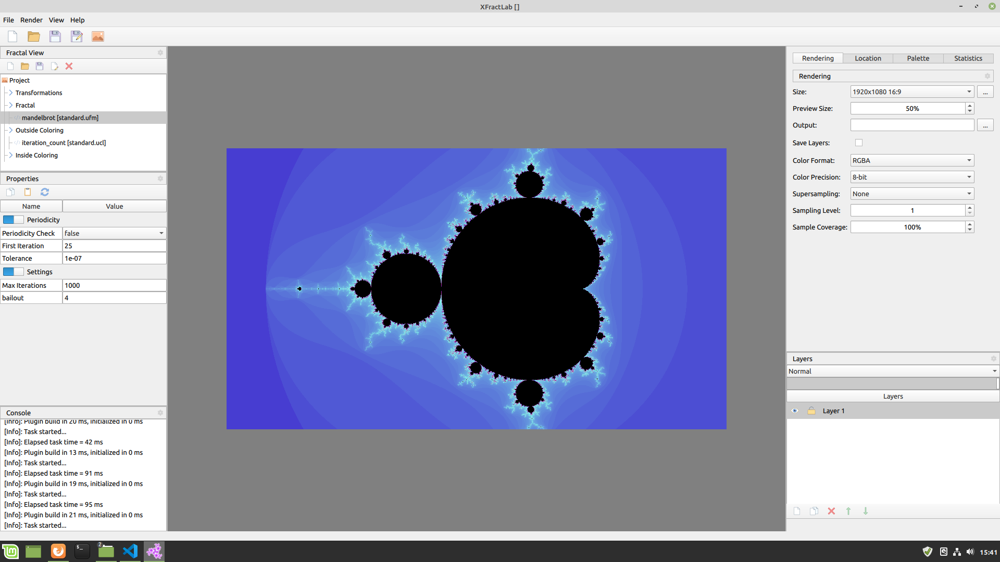

# **XFractLab**
## Download latest version from [GitHub](https://github.com/drdwrd/XFractLab-releases)

## **About**

XFractLab is a program to render fractals using specialized formulas. Built in compiler lets you image a wide variety of fractals while maintaining high performance. Multithreaded renderer scales with any number of cores, allowing to use your machine to its full capabilities.

## **Formulas**
XFractLab supports subset of UltraFractal formula syntax. Formulas are compiled directly to machine code, enabling creativity and freedom without compromising speed. You can implement your own fractals, explore, share with others.

## **Renderer**
Fast, multithreaded renderer allows for smooth and snappy experience. Wide variety of options let you customize existing formulas without delving into details of formula programming. Interactive preview lets you explore fractals in real time, simply using the mouse. Editable palettes (independently for inside/outside coloring formulas) can also be previewed in real-time. Multiple layers allow you to layer, blend fractal images in a similar manner to painting programs.

## **User Interface**
XFractaLab uses Qt to deliver modern feel-and-look highly interactive GUI.

## **Requirements**
- Windows 7, 8 or 10 64-bit
- OpenGL 4.5 support
- For smooth experience
    - 4GB or RAM
    - 2-core processor

## **Licensing**
XFractLab is free to use, for more details check the [license](https://drdwrd.github.io/xfractlab/license.txt)

## **Formula Compatibility**
Most of UltraFractal formulas should work right out of the box. Some features however are not implemented:
- class support
- user defined functions
- preprocessor directives
- dynamic arrays
- some builtin functions
